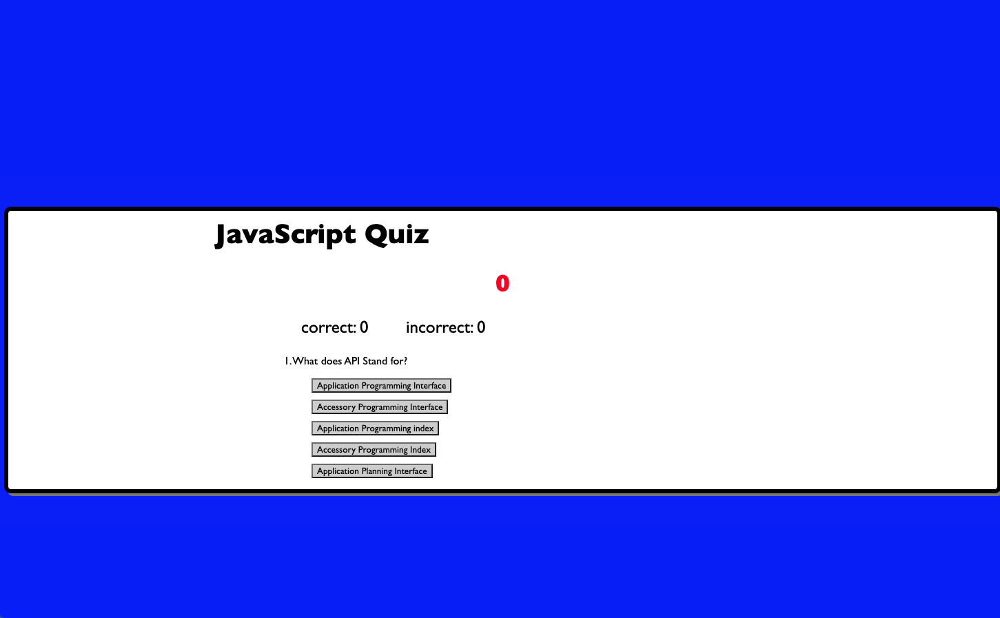

   Quizjs4

Description
This project was to create a timed quiz using javascript. Many different lessons from our coursework so far was utilized in order to make this work. The basic layout and styling were done with HTML and CSS. Eventlisteners were added to the start button to iniate the quiz. Up click of the start button the button itself, as well as the rules to the game disappear and are replaced with the test questions. The test questions were defined in an array and a for loop used to cycle though the index until every question is displayed, or the timer runs out. A timer was added to keep track of remaining time. For each question answered incorrectly additional time is subtracted from the clock. A series of interlocking fuctions are used to progress the game. Upon time running out, or the last question being answered the final score is displayed. High scores are logged using localbrowswer storage.

Installation
Link to Deployed website: https://drawlin22.github.io/Quizjs4/

Usage

Credits

Tutor help : Sam Pai

Peer colaboration: Chelsea Wagner

https://github.com/caf62219/javascript-timed-quiz

License
Please refer to the LICENSE in the repo.

   
   
   
   
   
   
   
   
   
   
   

  